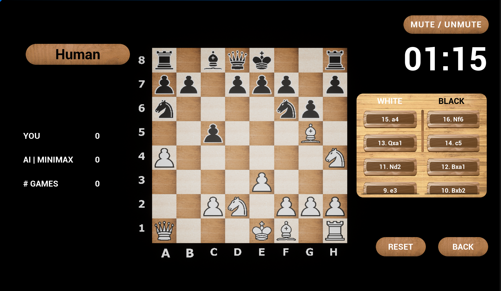

# CHESS

## WHAT
- Individual project for Design and Analysis of Algorithms course at the University of Genoa
- Developing a chess game implementing two different CPU intelligences: Random and Smart. 
The smart one is the result of specific algorithms such as MiniMax and Alpha-beta pruning

## LEARNING
- Decision algorithms
- Fast prototyping

## STACK
- C++
- Unreal Engine

### SAMPLE GAME

### UML
TO ADD

NEXT:
	- valutare promozione pedone in minimax 
	- testare replay (soprattutto con checkmate)

	- condizione di ripristino del castling (in human player) NON vanno bene 
		=> l'essere in quella posizione non implica il non aver mai mosso quella pedina 
			(salvo anche l'informazione del castling)

	- testare il castling quando il re è minacciato o si muove sotto scacco

	- EVALUATION
		return immediately if checkmate

How To Create UMG UI in Unreal Engine - Animating Widgets 
https://youtu.be/SD66UgyHiMM?si=ZoCKFO_R1YV-gRLk

bottoni legno:
	- <a href="https://www.freepik.com/free-vector/wooden-buttons-different-shapes-vector-illustrations-set-play-stop-check-star-buttons-with-wood-texture-progress-bar-white-background-user-interface-concept-game-app-website-design_24645050.htm">Image by pch.vector</a> on Freepik

#### TODO:
segnalazione di elementi null tramite UE_LOG()
- [ ] Leggere regolamento (e implementare regole particolari di mangiare e proteggere re)
- [ ] aggiungere controlli nei parametri per != nullptr
- [ ] calcolo ischeck 1° for superfluo se gli passo un pawn (vuol dire che è sottoscacco e voglio provare a liberarmi)
- [ ] std::pair va bene o unreal si offende
- [ ] se king si posiziona tale che vuole mangiare l'altro king => situazione da gestire come non consentita (non la gestisco perché appena trovo king sotto attacco, faccio break)

#### BUGS
- Save board 
	=> a volte l'ultima mossa non viene caricata correttamente (video sul telefono)
- [ ] Save board status quando scacco matto (salva due mosse in una (fatto video con telefono))
- [ ] quando clicco back mentre gioca l'avversario, crasha tutto :) (disabilito i bottoni)
- [ ] score counting

#### EXTRA
- [ ] MEttere tutte le stringhe in TEXT("...")
- [ ] vedere bene quali metodi possono essere definiti costanti (const)
- [ ] Fare menu in cui si sceglie il colore delle tile, delle pedine e del tavolo da gioco (sfondo, piuttosto che vuoto)
- [ ] Material dei blueprint pezzi dinamico => non 6 e 6 ma solo 6
- [ ] Transizione da menu a tavolo da gioco, con luce che incrementa man mano
- [ ] sito web (how to play chess)
- [ ] Movement&capture pawn sound (anche musica sottofondo e vittoria / sconfitta + messaggio vittoria/sconfitta/pareggio a centro schermo)
- [ ] Commenti avversario (tipo chess.com)
- [ ] Caricare specifica configurazione di partita (per allenarti) digitando dove posizionare le varie pedine
- [ ] Account per registrare uno storico delle partite fatte con i risultati e uno ?screenshot? della board finale

- [ ] FUNZIONI CHE RITORNANO VALORI PER IDENTIFICARE ERRORI ?

- [ ] cercare modo efficiente scacco e salvataggio partita (anche se memorizzando solo posizione hai tempo di ricostruzione della partita in O(1))
- [ ] REPLAY => va bene così, o conviene fare man mano dallo stato iniziale convertendo #id mossa a mossa sul campo ?
- [ ] Aggiungere attributo a piece => riferimento a tile
- [ ] 
- [ ] SETTINGS
- [ ]	=> Audio

#### CHANGES
	- Pawn		->	Piece
	- EatFlag	->	in CaptureFlag
	- Field		->	Board
